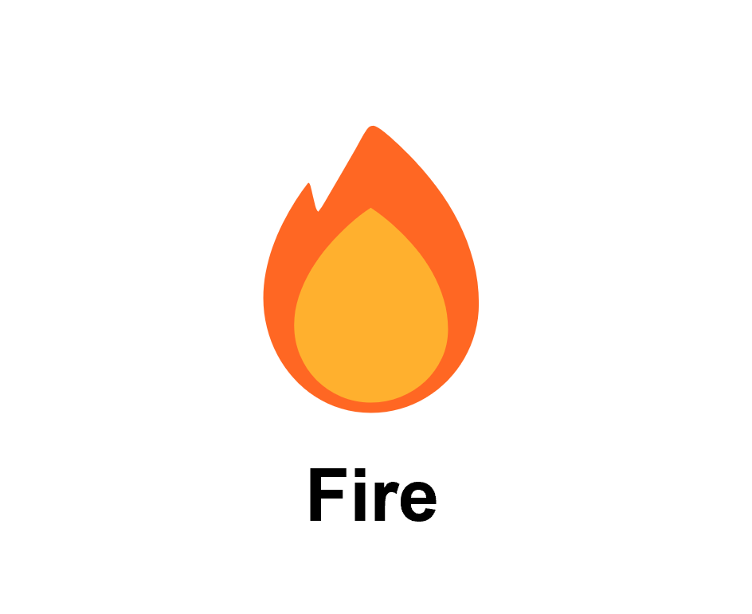
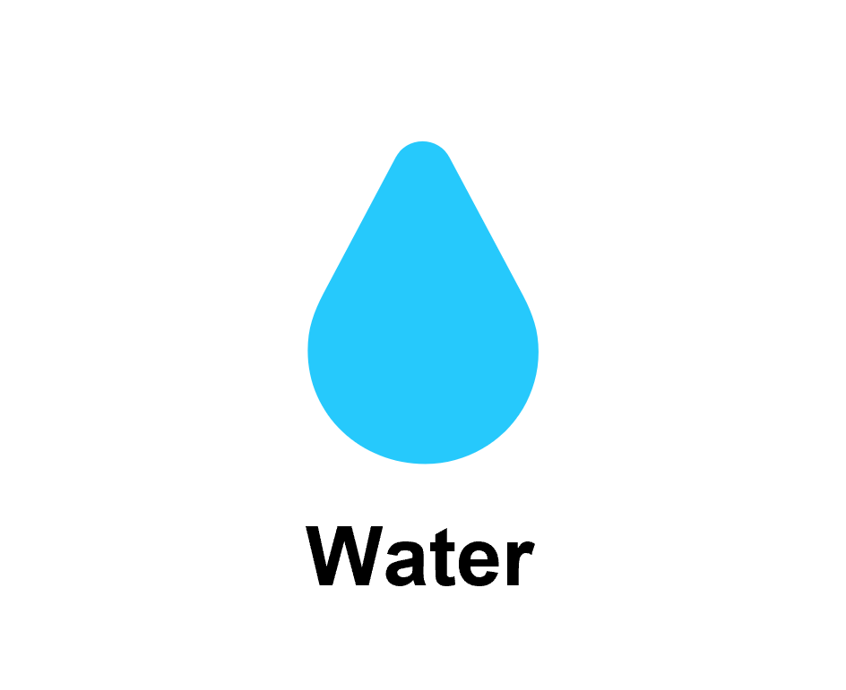
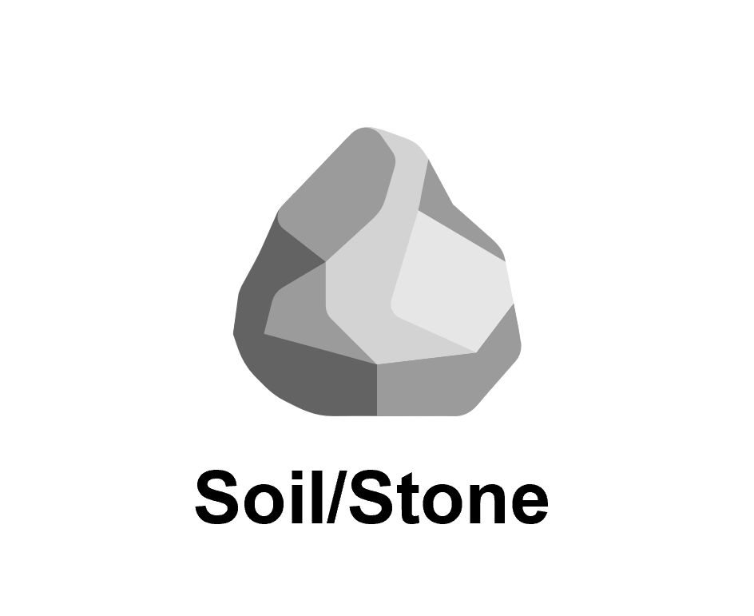
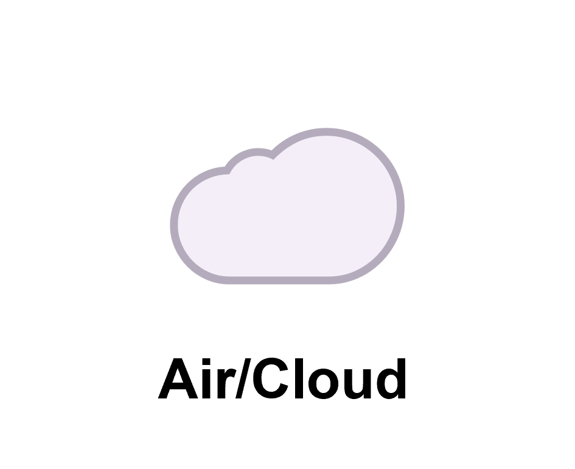
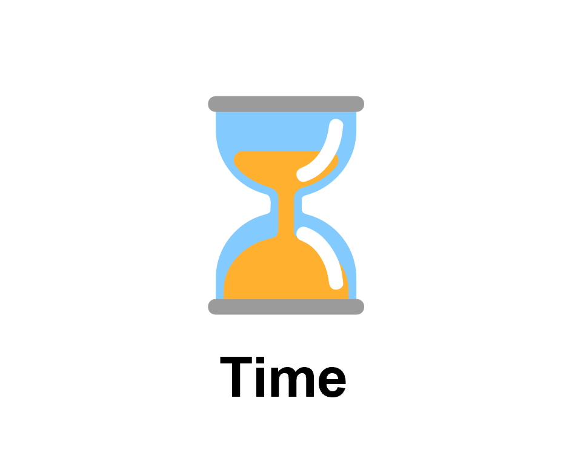
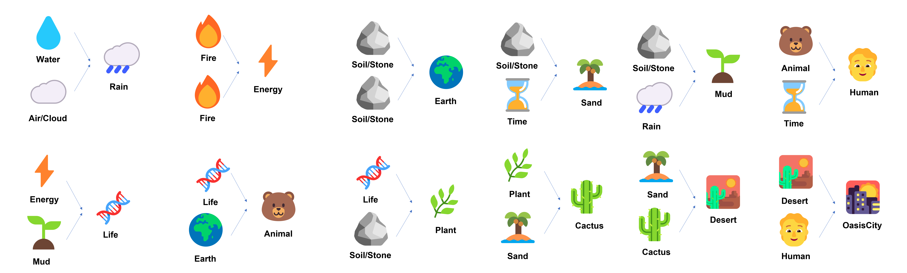
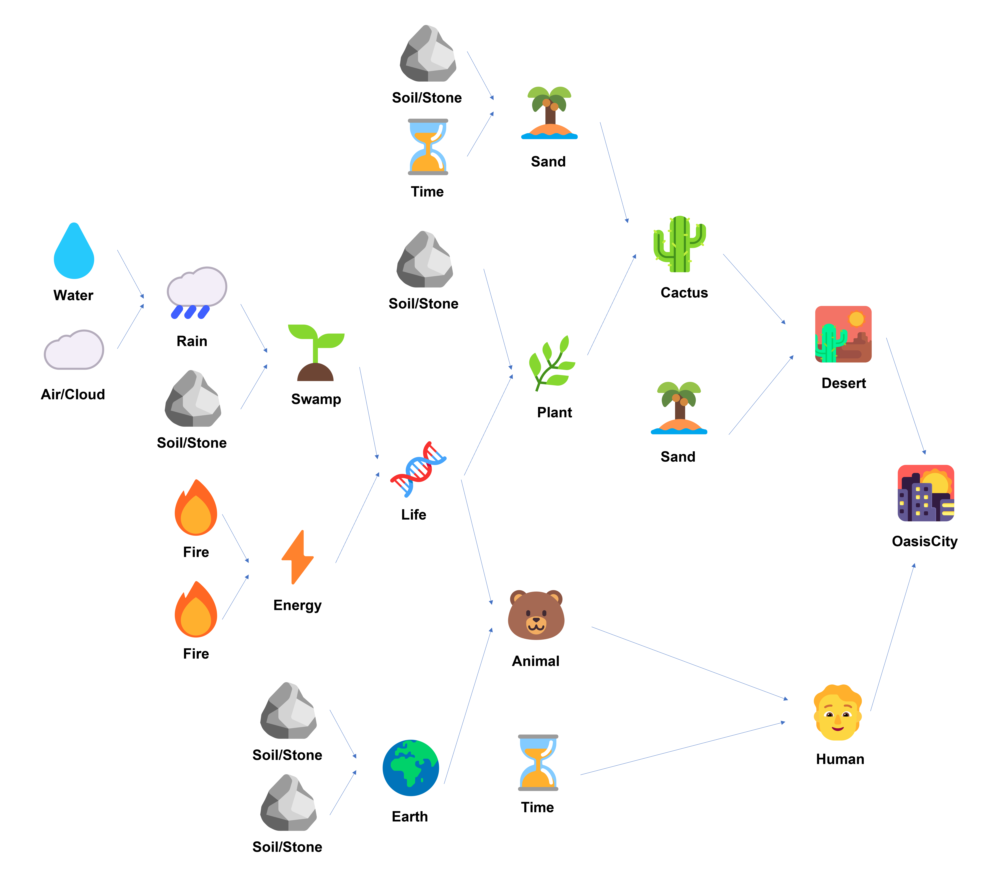

# All levels

## Level 1: Goal => Create Human? Cactus? 

### Basic Elements

Design following 5 basic elements. (Basic elements could differ between level)

|        Fire         |         Water         |     Soil/Stone      |      Air/Cloud      |        Time         |
| :-----------------: | :-------------------: | :-----------------: | :-----------------: | :-----------------: |
|  |  |  |  |  |

Fire                    
- https://sketchfab.com/3d-models/low-poly-campfire-695c62069ac44614acbfc6effcf7499d
- Animated: https://sketchfab.com/3d-models/fire-8161ae32b81446b397a0efcd36796753

Water                  
- https://sketchfab.com/3d-models/cc0-drops-f8f24228aebf41f297c878ad82ea7db0

Soil                    
- Not Found maybe use terrain tool to draw?

Cloud                   
- https://sketchfab.com/3d-models/clouds-116f49c23c4347eba340d0f59b0601f7

Time
- Animated: https://sketchfab.com/3d-models/math-clock-realtime-animation-wall-clock-143e8602ebc84f88b08f63f6b1fb4cf6

Following rules will be used in **Level 1**.

Also see here.

### Combinations 
Sand = Soil + Time

Rain = Water + Cloud   
- Animated: https://sketchfab.com/3d-models/rain-251b2387a91040a98da7b51bc5ca686e
- Static: https://sketchfab.com/3d-models/umbrella-cloud-f89d7c1d2e184187b4816f740fe0a44f

Energy = Fire + Fire    
- Animated: https://sketchfab.com/3d-models/energy-sphere-d3c2a8e291604dd4b41bdd7d295e1c90

Earth = Soil + Soil     
- Animated: https://sketchfab.com/3d-models/earth-roll-39dbf14a2ec84a2089ef4331cf38e292

Mud = Soil + Rain    
- Any good idea?

Life = Mud + Energy  
- Animated: https://sketchfab.com/3d-models/dna-vr-interactive-animation-c9a926f139044470ad3fb053c66ad71e

Plant = Life + Soil     
- Animated: https://sketchfab.com/3d-models/rigged-indoor-plant-animation-test-352cdd28d4e2404b82d971ba7828b5fd

Animal = Life + Earth
- Animated Fox: https://sketchfab.com/3d-models/floating-fox-497de71996cf4f4d86e387028938aceb
- Animated Cat: https://sketchfab.com/3d-models/toon-cat-free-b2bd1ee7858444bda366110a2d960386
- Animated Dog: https://sketchfab.com/3d-models/playful-dog-ec87fabdf4c3434fb03fecb67eeea6cc

Cactus = Sand + Plant
- Animated: https://sketchfab.com/3d-models/cactus-walk-5a165086aa164d5fabed5fdff382baa4#download

Desert = Cactus + Sand
- Animated: https://sketchfab.com/3d-models/desert-diorama-3bab6cf2977a47bc84aec68fdf7a3df3#download

Human = Animal + Time 
- Animated Man And Woman: https://sketchfab.com/3d-models/man-woman-walk-bbaa566445074509a32ef5059a9d0bc2

OasisCity = Human + Desert

## Level 2: Goal => Automotive

Basic elements: Fire, Soil, Metal, Wood

- Metal: https://sketchfab.com/3d-models/copper-ore-7c527a14f07444218e29471d4e9f081f 

- Wood: https://sketchfab.com/3d-models/wood-stick-04-b7fe8a4a3c2f4f038662ae47cfbfa6a7

1. Automotive = Engine + Carriage
   
   - https://sketchfab.com/3d-models/toy-car-high-poly-model-c844e7417c284edc90ef9ebd52f9f9f9

2. Engine = Energy + Machine
   
   - https://sketchfab.com/3d-models/3d-printable-radial-pneumatic-engine-3cbddbecd6c5462391e9936a3ccd7d32

   Carriage = Seat + Wheel

   - https://sketchfab.com/3d-models/19th-century-carriage-db4460e67e164cdcb33b0c3ba31c641d

3. Energy = Fire + Fire

   Machine = Tool + Component

   - https://sketchfab.com/3d-models/old-machine-2cd85a013c69451781fb207b5c2f3e22

   Seat = Tool + Board

   - https://sketchfab.com/3d-models/sborg-wood-base-8883b9bd72e84a29a16eb3bbfe5f941d

   Wheel = Tool + Metal

   - https://sketchfab.com/3d-models/old-wheel-808beb7b67ab4f73b5a03f641ddec3e1

4. Tool = Energy + Soil
   
   - https://sketchfab.com/3d-models/hammer-2faa70b89da743d2924670ffe7d80163

   Component = Fire + Metal

   - https://sketchfab.com/3d-models/cardioid-curve-mechanism-8f5dd8204c634277aa420601fdaf9016#download

   Board = Wood + Wood

   - https://sketchfab.com/3d-models/wooden-board-28cc2674d4ca44dc9000580c10c84115

5. Energy = Fire + Fire

**Obsolete**

Brick = Mud + Fire

Building = Brick + Human

City = Building + Building

Paper = Water + Plant

Book = Paper + Paper

Student = Book + Human

University/TUM = Student + City

## Level 3: 
Element combinations:

Wooden ship = Boat + Wood | Holzschiff = Boot + Holz

Boat = Wood + Water | Boot = Holz + Wasser

Wood = Tree + Tools | Holz = Baum + Werkzeug

Tools = Stone + Energy | Werkzeug = Stein + Energie

Tree = Earth + Seed | Baum = Erde + Samen

Seed = Life + Sand | Samen = Leben + Sand

Life = Energy + Swamp | Leben = Energie + Sumpf

Sand = Stone + Water | Sand = Stein + Wasser

Energy = Fire + Air | Energie = Feuer + Luft (DONE)

Swamp = Earth + Water | Sumpf = Erde + Wasser (DONE)

Stone = Lava + Water | Stein = Lava + Wasser

Lava = Earth + Fire | Lava = Erde + Feuer (DONE)

Wooden Ship | Holzschiff: https://assetstore.unity.com/packages/3d/vehicles/sea/brig-sloop-sailing-ship-77862

Boat | Boot: https://assetstore.unity.com/packages/3d/vehicles/sea/boats-polypack-189866

Wood | Holz: https://assetstore.unity.com/packages/2d/textures-materials/wood/pbr-log-149788

Tree | Baum: https://assetstore.unity.com/packages/3d/vegetation/trees/free-trees-103208

Tools | Werkzeug: https://assetstore.unity.com/packages/3d/props/industrial/workplace-tools-86242

Seed | Samen: https://sketchfab.com/3d-models/sunflower-seed-bf3bae75c18a457195ee602511fb2745

https://www.turbosquid.com/3d-models/free-obj-mode-pumpkin-seed/626117#

Life | Leben: https://cults3d.com/en/3d-model/art/arbre-de-vie-oasisk-2

Sand | Sand: https://assetstore.unity.com/packages/2d/textures-materials/floors/pbr-sand-materials-free-160123

Energy | Energie: https://assetstore.unity.com/packages/2d/textures-materials/15-free-auras-24463

https://assetstore.unity.com/packages/2d/textures-materials/abstract/vibrant-effect-textures-sample-35514

Swamp | Sumpf: https://assetstore.unity.com/packages/2d/textures-materials/floors/swamp-grass-material-137091

Stone | Stein: https://assetstore.unity.com/packages/3d/props/exterior/stone-651

Lava | Lava: https://assetstore.unity.com/packages/2d/textures-materials/floors/hand-painted-seamless-lava-texture-158352
